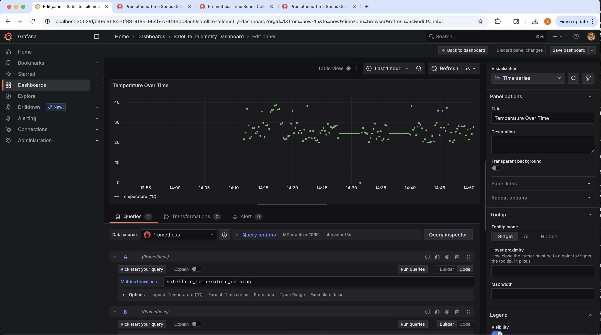

# Satellite Telemetry System


## 🛠️ Technology Stack

- **Backend**: Go (Fiber framework)
- **Database**: PostgreSQL with TimescaleDB extension
- **Frontend**: React with Recharts for visualization
- **Monitoring**: Prometheus + Grafana
- **Containerization**: Docker Compose
- **Protocol**: CCSDS (Consultative Committee for Space Data Systems)

## Screenshots

### Frontend


### Grafana




### Prometheus


### Go Unit Tests


### Integration Tests


### Frontend Unit Tests


### GET /api/v1/telemetry


### GET /api/v1/telemetry/current


### GET /api/v1/telemetry/anomalies


### GET /api/v1/telemetry/aggregations


## Setup Instruction

1. **Clone the repository**
   ```bash
   git clone <repository-url>
   cd satellite-telemetry-dashboard
   ```

2. **Start all services**
   ```bash
   docker-compose up -d
   ```

3. **Access the applications**
   - **Dashboard**: http://localhost:3000
   - **API**: http://localhost:8080
   - **Grafana**: http://localhost:3001 (admin/admin)
   - **Prometheus**: http://localhost:9090

4. **Monitor logs**
   ```bash
   docker-compose logs -f
   ```

## 📊 API Endpoints

### Telemetry Data
- `GET /api/v1/telemetry` - Historical telemetry with time filtering
- `GET /api/v1/telemetry/current` - Latest telemetry values
- `GET /api/v1/telemetry/anomalies` - Anomaly history
- `GET /api/v1/telemetry/aggregations` - Aggregated data over time

### Health Check
- `GET /health` - Service health status

### Query Parameters
- `start_time` (ISO8601): Start of time range
- `end_time` (ISO8601): End of time range
- `limit` (int): Maximum number of records
- `bucket_size` (string): Aggregation time bucket (e.g., "1 hour")

## 🔧 Configuration

### Environment Variables

#### Database
- `DB_HOST`: Database host (default: localhost)
- `DB_PORT`: Database port (default: 5432)
- `DB_NAME`: Database name (default: telemetry)
- `DB_USER`: Database user (default: telemetry_user)
- `DB_PASSWORD`: Database password (default: telemetry_pass)

#### Services
- `UDP_PORT`: Ingestion service port (default: 8090)
- `API_PORT`: API service port (default: 8080)
- `REACT_APP_API_URL`: Frontend API URL

### Database Schema

#### Telemetry Table
```sql
CREATE TABLE telemetry (
    id SERIAL PRIMARY KEY,
    timestamp TIMESTAMPTZ NOT NULL,
    packet_id INTEGER NOT NULL,
    packet_seq_ctrl INTEGER NOT NULL,
    subsystem_id INTEGER NOT NULL,
    temperature REAL NOT NULL,
    battery REAL NOT NULL,
    altitude REAL NOT NULL,
    signal_strength REAL NOT NULL,
    is_anomaly BOOLEAN DEFAULT FALSE,
    anomaly_type VARCHAR(50),
    created_at TIMESTAMPTZ DEFAULT NOW()
);
```

#### Anomaly History Table
```sql
CREATE TABLE anomaly_history (
    id SERIAL PRIMARY KEY,
    telemetry_id INTEGER REFERENCES telemetry(id),
    timestamp TIMESTAMPTZ NOT NULL,
    anomaly_type VARCHAR(50) NOT NULL,
    parameter_name VARCHAR(50) NOT NULL,
    parameter_value REAL NOT NULL,
    threshold_value REAL NOT NULL,
    severity VARCHAR(20) DEFAULT 'WARNING',
    acknowledged BOOLEAN DEFAULT FALSE,
    acknowledged_at TIMESTAMPTZ,
    created_at TIMESTAMPTZ DEFAULT NOW()
);
```

## Testing

### Manual Testing
1. Start the system with `docker-compose up -d`
2. Wait for all services to be healthy
3. Access the dashboard at http://localhost:3000
4. Verify real-time data updates
5. Test time range filtering
6. Check anomaly detection

### API Testing
```bash
# Get current status
curl http://localhost:8080/api/v1/telemetry/current

# Get historical data
curl "http://localhost:8080/api/v1/telemetry?start_time=2024-01-01T00:00:00Z&end_time=2024-01-02T00:00:00Z"

# Get anomalies
curl http://localhost:8080/api/v1/telemetry/anomalies

# Get aggregations
curl "http://localhost:8080/api/v1/telemetry/aggregations?bucket_size=1%20hour"
```

## Monitoring

### Prometheus Metrics
- Service health and performance
- Database connection status
- API request rates and latencies
- Telemetry packet processing rates

### Grafana Dashboards
- Real-time telemetry visualization
- Anomaly detection trends
- System performance metrics
- Historical data analysis


### Log Locations
- **Application logs**: `docker-compose logs -f`
- **Database logs**: `docker-compose logs postgres`
- **Frontend logs**: Browser developer console

## Development

### Adding New Features
1. Modify the appropriate service code
2. Update Docker images: `docker-compose build`
3. Restart services: `docker-compose up -d`

### Database Migrations
1. Add migration scripts to `db/` directory
2. Update `init.sql` for new deployments
3. For existing deployments, run migrations manually

### API Extensions
1. Add new endpoints to `telemetry-api/main.go`
2. Update frontend to use new endpoints
3. Add appropriate error handling


## Backend Setup (Go + Fiber + PostgreSQL/TimescaleDB)

### 1. **Environment Variables**
Create a `.env` file or set these variables in your environment:
```
DB_HOST=localhost
DB_PORT=5432
DB_NAME=telemetry
DB_USER=telemetry_user
DB_PASSWORD=telemetry_pass
API_PORT=8080
```

### 2. **Run with Docker Compose**
```bash
docker compose up -d --build
```
- This will start the database, backend API, and frontend.
- API will be available at: `http://localhost:8080`

### 3. **Run Backend Locally (Optional)**
```bash
cd telemetry-api
go mod download
go run main.go
```

## Frontend Setup (React)

### 1. **Install Dependencies**
```bash
cd telemetry-frontend
npm install
```

### 2. **Run Locally**
```bash
npm start
```
- Frontend will be available at: `http://localhost:3000`

### 3. **Build for Production**
```bash
npm run build
```

## Testing

### **Backend Unit Tests (Go)**

#### Run Tests:
```bash
cd telemetry-api
go test -v
```

#### Run Tests with Coverage:
```bash
go test -v -cover
```

#### Run Specific Test:
```bash
go test -v -run TestHealthEndpoint
```

#### Run Benchmark Tests:
```bash
go test -v -bench=.
```

#### Test Coverage Report:
```bash
go test -v -coverprofile=coverage.out
go tool cover -html=coverage.out -o coverage.html
```

### **Frontend Unit Tests (React)**

#### Run Tests:
```bash
cd telemetry-frontend
npm test
```

#### Run Tests in Watch Mode:
```bash
npm test -- --watch
```

#### Run Tests with Coverage:
```bash
npm test -- --coverage --watchAll=false
```

#### Run Specific Test File:
```bash
npm test -- App.test.js
```

#### Run Tests in CI Mode:
```bash
npm test -- --watchAll=false --coverage
```

### **Integration Tests**

#### Run Full Integration Test:
```bash
node integration-test.js
```


## Docker Commands

### **Useful Commands:**
```bash
# Start all services
docker compose up -d

# Stop all services
docker compose down

# Restart specific service
docker compose restart telemetry-api
docker compose restart telemetry-frontend

# View logs
docker compose logs -f telemetry-api
docker compose logs -f telemetry-frontend

# Rebuild and restart
docker compose up -d --build

# Check service status
docker compose ps
```

## Development Notes

### **Environment Files:**
- Create `.env` files for local development
- `.gitignore` includes `node_modules/` and `.env` files

### **API Endpoints:**
- Health: `GET /health`
- Current Status: `GET /api/v1/telemetry/current`
- Telemetry: `GET /api/v1/telemetry?start_time=...&end_time=...&limit=...`
- Anomalies: `GET /api/v1/telemetry/anomalies?start_time=...&end_time=...&limit=...`
- Aggregations: `GET /api/v1/telemetry/aggregations?start_time=...&end_time=...&bucket_size=...`

### **Time Format:**
- Use ISO8601 format: `2024-01-24T12:00:00Z`
- Example: `http://localhost:8080/api/v1/telemetry?start_time=2024-01-24T00:00:00Z&end_time=2024-01-24T23:59:59Z`


### **Logs:**
```bash
# View all logs
docker compose logs

# View specific service logs
docker compose logs telemetry-api
docker compose logs telemetry-frontend
``` 